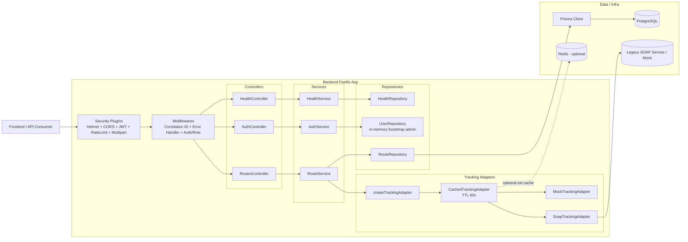
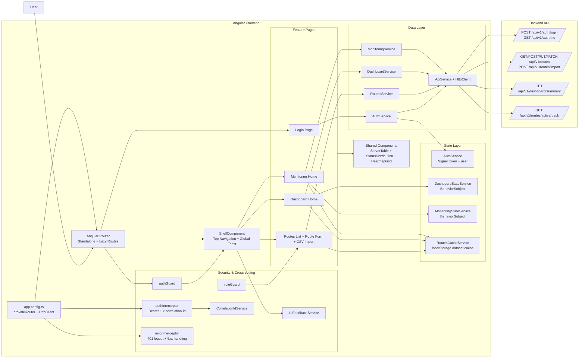

# Architecture Diagram

Mermaid diagrams below are ready to paste into draw.io (`Arrange -> Insert -> Advanced -> Mermaid`).

## Backend Architecture (Current)

## Frontend Architecture (Current Angular Build)

